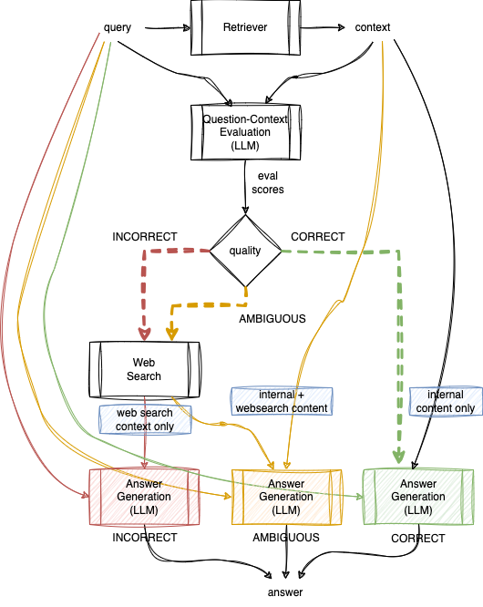
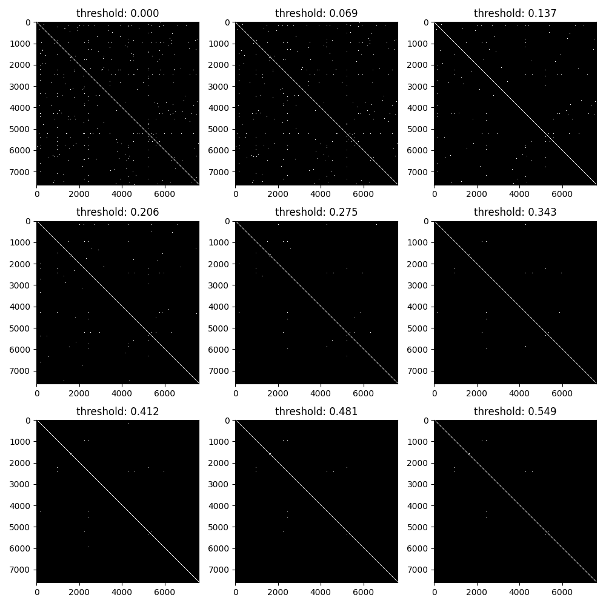

# llm-doc-explore

Platform to teach myself cool SoTA LLM stuff like langchain and llamaindex, while (hopefully) also creating something useful.

Sources:
* [LangChain for LLM Application Development](https://www.deeplearning.ai/short-courses/langchain-for-llm-application-development/) from DeepLearning.AI
* [LangChain: Chat with your Data](https://www.deeplearning.ai/short-courses/langchain-chat-with-your-data/) from DeepLearning.AI

Another good reference for Advanced RAG pipelines is the paper [Retrieval-Augmented Generation for Large Language Models: A Survey](https://arxiv.org/abs/2312.10997) (Gao et al, 2023).

## Table of Contents

* [Data Prep](#data-prep)
  * [Convert PDF to text: pypdf2](#convert-pdf-to-text-pypdf2)
  * [Parse Converted text to Chapters and Paragraphs](#parse-converted-text-to-chapters-and-paragraphs)
  * [Hierarchical Indexes with LlamaIndex](#hierarchical-indexes-with-llamaindex)
    * [Clustering using Semantic Chunking](#clustering-using-semantic-chunking)
    * [Clustering using RAPTOR](#clustering-using-raptor)
* [Chains](#chains)
  * [Simple (Naive) RAG](#simple-naive-rag)
  * [RAG with custom Retriever](#rag-with-custom-retriever)
  * [Question Generation and Evaluation](#question-generation-and-evaluation)
  * [Conversational Search with Memory](#conversational-search-with-memory)
  * [Corrective RAG (CRAG)](#corrective-rag-crag)
  * [Self-Reflective RAG (Self-RAG)](#self-reflective-rag-self-rag)
  * [Semantic Router](#semantic-router)
  * [Graph RAG](#graph-rag)
  * [Agent based Search](#agent-based-search)
* [Retrievers](#retrievers)
  * [Vector Search](#vector-search)
  * [Lexical + Vector Search Sequence](#lexical---vector-search-sequence)
  * [Hybrid Lexical and Vector Search with RRF merging](#hybrid-lexical-and-vector-search-with-rrf-merging)
  * [Web Search](#web-search)
  * [Hypothetical Document Embedding (HyDE) Search](#hypothetical-document-embedding-hyde-search)
  * [RAG Fusion Retriever](#rag-fusion-retriever)
  * [Parent Document Retriever](#parent-document-retriever)

## Data Prep

### Convert PDF to text: pypdf2

* Used the command line tool from PyPDF2 to convert the PDF from the book [Snowflake: The Definitive Guide](https://www.snowflake.com/resource/snowflake-definitive-guide/) to text.

### Parse Converted text to Chapters and Paragraphs

* Used `prep/reformat_file.py` to convert PyPDF2 text chapter and question files processable by downstream components.
* Used `prep/chunk_and_index.py` to chunk text and write out to Chroma vectorstore and BM25 indexes.

### Hierarchical Indexes with LlamaIndex

[llama_index](https://github.com/run-llama/llama_index) is another framework similar to LangChain whose focus seems to be on data enrichment rather than implementing novel query pipelines. It has a much richer (over-engineered?) analog of LangChain's `Document`, the `TextNode`.

Using LlamaIndex for data preparation and enrichment using its `IngestionPipeline` and serializing the chunks (with embeddings) to disk as LangChain `Document` objects is implemented in `prep/semchunk_hnode_builder.py`.

Summarization of the text in the parent nodes is a combination of Extractive Summarization (using `bert-extractive-summarizer`) of the child node texts, then using a HuggingFace `summarization` pipeline on the extractive summaries to create a single abstractive summary.

#### Clustering using Semantic Chunking

While Semantic Chunking is primarily meant for text chunking, with implementations in both [LangChain](https://python.langchain.com/docs/modules/data_connection/document_transformers/semantic-chunker) and [LlamaIndex](https://docs.llamaindex.ai/en/latest/examples/node_parsers/semantic_chunking.html), we use the idea to cluster consecutive chunks, and summarize the chunk texts into a parent chunk. The parent chunks can be flattened along with the others, or arranged in a hierarchy using the `TextNode.relationship` dictionary, or it can be flattened out as LangChain's `Document.metadata["rel_RELNAME"]` abstraction as we have done in `prep/semchunk_hnode_builder.py`.

#### Clustering using RAPTOR

Yet another clustering implementation [RAPTOR: Recursive Abstractive Processing for Tree-Organized Retrieval](https://arxiv.org/abs/2401.18059) clusters all chunks in the corpus in an attempt to find structure that can be directly leveraged by the RAG client without having to use novel pipelines. It uses [UMAP (Uniform Manifold Approximation and Projection)](https://umap-learn.readthedocs.io/en/latest/) to reduce dimensionality of chunk embedding vectors and [Gaussian Mixture Models](https://jakevdp.github.io/PythonDataScienceHandbook/05.12-gaussian-mixtures.html) to create soft clusters.

To find the optimum number of clusters, we sweep through a range and plot the [Aikake Information Criterion (AIC)](https://en.wikipedia.org/wiki/Akaike_information_criterion) and [Bayesian Information Criterion (BIC)](https://en.wikipedia.org/wiki/Bayesian_information_criterion) and look for a trough. The trough in BIC corresponds to the chapter split. There was no AIC trough visible, so we ended up with using a value that made sense.

The clusters generated by the GMM is shown below.

GMM Clustering is implemented in `prep/raptor_clustering.py` and it writes out a cluster membership file which is incorporated into the LangChain Chunk JSONs via `prep/raptor_hnode_builder.py` (which works with LangChain `Documents` so no LlamaIndex dependencies).

## Chains

I find that LangChain has many interesting patterns, but most (all?) of them are optimized for the GPT family of LLMs. Also custom chains are based on prompts that may or may not be optimized for your particular use case (see [langchain's stance on Anthropic's Claude](https://python.langchain.com/docs/integrations/platforms/anthropic) for example). Since my environment is different from the default, all the chains here are built using the [LangChain Expression Language (LCEL)](https://python.langchain.com/docs/expression_language/) and custom prompts optimized for Anthropic Claude (on AWS Bedrock). Furthermore, I have tried to leverage Claude's strengths in XML generation via custom formatting instructions per prompt rather than relying on the vanilla formatting instructions from canned LangChain Output Parsers.

I have also started leveraging the `asyncio` library (also used by LangChain for its asynchronous methods) to implement parallel processing (map-reduce style chains) for LCEL chains that need this functionality.

Major patterns used here are as follows:

1. Use LCEL chains instead of using built-in LangChain chains, which are [now being considered legacy](https://python.langchain.com/docs/modules/chains) by the project anyway.
2. Generate your own prompt templates by adapting prompts from built-in chains. Use `langchain.debug = True` to figure out prompts if not readily understandable.
3. Store prompt templates in separate text files.
4. Put in your own custom XML Formatting instructions in prompt template rather than depend on formatting instructions in built-in OutputParsers.
5. Use the `StrOutputParser` to capture the XML output and use `pydantic_xml` to convert into Pydantic objects for downstream chains.
6. XML to Pydantic has to be outside the LCEL chain because Langchain depends on Pydantic V1 and `pydantic_xml` depends on Pydantic V2 and [langchain project has no immediate plans to upgrade](https://python.langchain.com/docs/guides/pydantic_compatibility).

### Simple (Naive) RAG

Replicating the chain described in the Question and Answer lesson of the LangChain for LLM Application Development course.

The flow is implemented in `rag_chain.py`. 

### RAG with custom Retriever

The `bm25_vec_rag_chain.py` is a slight modification of the RAG chain above to find the chapter filter to be applied to the vector store by doing a Lexical (TF-IDF) lookup on the chapter index with the question, and passing the extracted chapter ID as a filter to the vector search. The combination of lexical followed by vector search is implemented using a custom retriever as [described in the LangChain Retrievers Documentation](https://python.langchain.com/docs/modules/data_connection/retrievers/).

### Question Generation and Evaluation

Replicating the chain described in the Evaluation lesson of the LangChain for LLM Application Development course.

This is implemented in `qgen_eval_chain.py`.

### Conversational Search with Memory

Replicating chain described in Memory lesson of the LangChain for LLM Application Development course and Chat lesson in LangChain: Chat with your data course.

This is implemented in `conv_rag_chain.py`.

### Corrective RAG (CRAG)

Checks quality of retrieved context and based on quality, uses web search context to supplement or replace. Described in [Corrective Retrieval Augmented Generation](https://arxiv.org/abs/2401.15884).

This is implemented in `crag_eval_chain.png`.

### Self-Reflective RAG (Self-RAG)

Does self-critique of artifacts produced before generating final answer. Described in paper [Self-RAG: Learning to Retrieve, Generate and Critique through Self-Reflection](https://arxiv.org/abs/2310.11511) and blog post [Self-Reflective RAG with LangGraph](https://blog.langchain.dev/agentic-rag-with-langgraph/). Implemented here with simplifications as outlined in the blog post, using a state machine implemented in Python. Another difference from the blog post is that it will do a web search rather than returning a null answer if it is unable to satisfy quality requirements via self-RAG.

This is implemented in `self_rag_chain.py`.

### Semantic Router

This chain requires a bit of background work, implemented in `prep/summarize_chapters.py`. Here we run extractive summarization to identify the top sentences in each chapter by TextRank, then re-arrange the sentences in the document, most relevant first, then chunk out the top 10k tokens. This chunk is then used to compute a chapter vector. The chapter vectors are dimensionality reduced and clustered into three "semantic clusters". (Note: clusters shown below does not have any discernible structure but we just used KMeans to split it up into 3 arbitrary clusters, since our objective is to mainly explore the technique).

Note that we also tried to summarize using the LLM using the refine method, but could not complete that as the LLM ran out of context space (it is not able to do iterative compression, the summary keeps getting larger each time). The implementation for this (failed) approach is in `prog_summary.py`.

At query time, we dimensionality reduce the question and find the most similar cluster and use that as a filter (multiple chapter IDs) to restrict the vector search to the chapters identified by the cluster.

This is implemented in `semantic_router.py`.

### Graph RAG

Adapted from the blog post [GraphRAG: Unlocking LLM Discovery on narrative private data](https://www.microsoft.com/en-us/research/blog/graphrag-unlocking-llm-discovery-on-narrative-private-data/) from Microsoft Research. Creates a graph representing the entire corpus, where nodes are noun phrases found in the text and edges are connections with other noun phrases that co-occur at least once with the first one and have a semantic similarity above a pre-determined threshold (we used cosine similarity >= 0.3 based on distribution of similarities computed in this way).

The histogram below shows the distribution of the count of number of noun-phrases in input chunks. Somewhat surprisingly the distribution seems linear.

In order to decide the threshold to use to connect a pair of noun phrases in the graph, we plotted the drop in similarity over all connected edges. (Note that we achieve an initial dropoff in edges by using the co-occurrence criterion). The heatmaps are plotted at different thresholds to visually decide a good cutoff to use.

At query time, noun phrases are extracted from the query and nearest noun phrase in the index is located (cosine similarity >= 0.95), then the neighbors of the index noun phrase are located. The original query noun phrases and these neighbor noun phrases are used to modify the original query using an LLM and the answer generated against this new query using a Naive RAG chain.

The backend code is implemented in `prep/build_graphrag_network.py` and the front end code (including comparison with Naive RAG) is implemnented in `chains/graph_rag_chain.py`. Results from initial experiments indicate that results from GraphRAG are not as good as that from Naive RAG, possibly because of the very low threshold for similarity being used results in spurious key phrases being retrieved and consequently dilutes the quality of the answer.

### Agent based Search

Defines three functions (annotated by `@tool`) with PyDoc descriptions to allow LCEL chain representing an Agent Executor to select appropriate function to invoke based on input question.

Wrapped CK (Solr) Search as a `@tool` for this agent based search.

## Retrievers

Following retrievers have been implemented (in `chains/my_retrievers.py`).

### Vector Search

Standard Vector Search against chunk vectors in ChromaDB.

### Lexical + Vector Search Sequence

Lexical (TF-IDF) search against index of chapters to find most likely chapter ID, then use the chapter ID to filter vector search result chunks from ChromaDB.

### Hybrid Lexical and Vector Search with RRF merging

Parallel Lexical (TF-IDF) search against index of chunks and Vector search against
chunk vectors in ChromaDB, results merged using [Reciprocal Rank Fusion (RRF)](https://dl.acm.org/doi/abs/10.1145/1571941.1572114).

### Web Search

Uses LangChain wrapper over [Search API](https://www.searchapi.io/) to do web search. First decomposes question into keyphrases and issues search using that.

### Hypothetical Document Embedding (HyDE) Search

Converts the incoming question to a "hypothetical document" by attempting to answer it without RAG support, then uses vector search against ChromaDB chunks using generated answer (passage).

### RAG Fusion Retriever

Uses LLM to generate multiple similar queries from the original query, then generates RAG results from all queries in parallel, then uses Reciprocal Rank Fusion (RRF) to merge the highest scoring top-k results.

### Parent Document Retriever

Matches chunks using vector search, identifies the containing chapter, and returns a smaller number of chapter text instead of the chunk text to the LLM to generate answers from.
